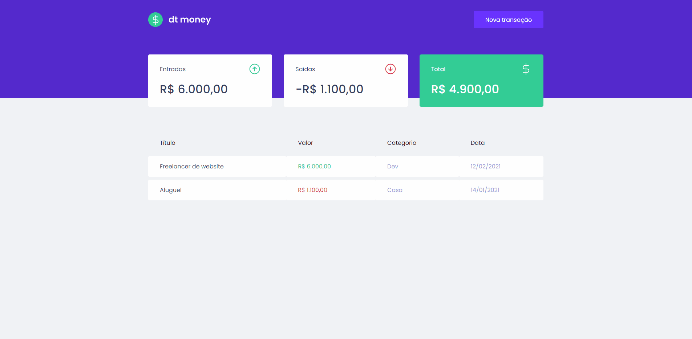

<h1 align="center">
    
</h1>

<p align="center"> 
  O projeto tem o objetivo de cadastrar transações, seja de entrada ou saída,
  o que pode te ajudar a realizar um planejamento financeiro, identificando os principais
  gastos e facilitando a decisão do que vai ser cortado.
</p>

## :computer: Aplicação Web
  <table>
    <tr>
      <th width="100%">
        DashBoard
      </th>
    </tr>
    <tr>
      <td>
          
      </td>
    </tr>
  </table>

## :bulb: Principais funcionalidades

* Cadastrar Transações.

* Visualizar Transações.

* Visualizar dados gerados pelas Transações cadastradas(Entradas, Saídas e Total).

## :wrench: Pré-requisitos

 Antes de começar, você vai precisar ter instalado em sua máquina as seguintes ferramentas:
[Node.js](https://nodejs.org/en/) e um editor para trabalhar com o código como o [VSCode](https://code.visualstudio.com/).

## :rocket: Para rodar a aplicação

```bash

# Clone este repositório
$ git clone https://github.com/Joaobru/DtMoney.git

# Acesse a pasta do projeto no seu terminal/cmd
$ cd DtMoney

# Execute o seguinte comando para instalar todas as dependências
$ npm install ou yarn

# Rode o projeto com o seguinte comando.
npm run start ou yarn start

# Agora você pode acessar em localhost:3000.

```

## 🛠 Tecnologias
  * [React](https://pt-br.reactjs.org/);

  * [TypeScript](https://www.typescriptlang.org/);

  * [MirageJS](https://miragejs.com/);

  * [Styled Components](https://styled-components.com/);

<h2> :book: Licença </h2>
<p>Lançado em 2021 :book:</p></br>
<p>Feito por João Paulo Brune Dos Santos. Este projeto está sobre a licença do MIT</p></br>
<p>Dar uma :star: se este projeto te ajudou</p>